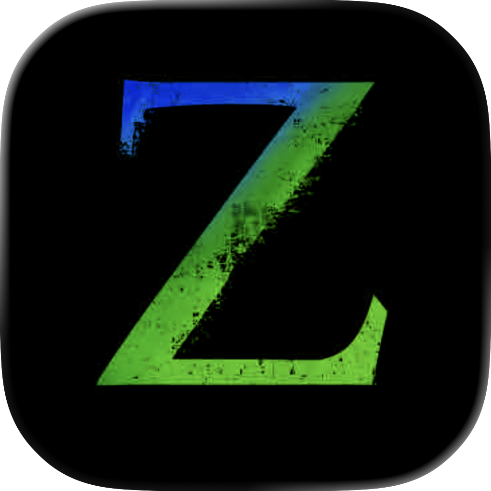

# Zonvie



Zonvie is a Fast, feature-rich Neovim GUI built with Zig, native on macOS and Windows.

## Features

- **Native Performance**: Zig core with Metal (macOS) and D3D11 (Windows) rendering
- **Zero-allocation Hot Paths**: Optimized for minimal latency during redraw/flush
- **Full Neovim UI API Compliance**: Supports ext_cmdline, ext_popupmenu, ext_messages, ext_tabline
- **Remote Development**:
  - SSH connection to remote hosts
  - Devcontainer support for containerized development environments
- **Customizable**: TOML configuration file

## Roadmap

| # | Step | Status |
|---|------|--------|
| 1 | Standard Neovim GUI functionality | ✅ |
| 2 | Multigrid Events compliance and rich window integration | ⚠️ |
| 3 | Basic customization (fonts, colors, blur, etc.) | ✅ |
| 4 | Cross-platform (macOS, Windows, Linux) | ⚠️ |
| 5 | Remote connection (SSH, server mode, devcontainer) | ⚠️ |
| 6 | Fancy features (cursor animation, neon/glow effects, etc.) | ❌ |

## Platforms

- **macOS**: AppKit + Swift + Metal
- **Windows**: Win32 + D3D11/DXGI + DirectWrite

## Installation

### macOS

Build from source (requires Xcode):

```bash
xcodebuild -project macos/zonvie.xcodeproj -scheme zonvie -configuration Release build
```

### Windows

Build from source (requires Zig 0.15.x):

```bash
zig build windows -Dtarget=x86_64-windows-gnu -Doptimize=ReleaseFast
```

## Usage

```bash
zonvie [OPTIONS] [--] [NVIM_ARGS...]
```

### Command Line Options

| Option | Description |
|--------|-------------|
| `--nofork` | Don't fork; stay attached to terminal, keep cwd |
| `--log <path>` | Write application logs to specified file path |
| `--extcmdline` | Enable external command line UI |
| `--extpopup` | Enable external popup menu UI |
| `--extmessages` | Enable external messages UI |
| `--exttabline` | Enable external tabline UI (Chrome-style tabs) |
| `--ssh=<user@host[:port]>` | Connect to remote host via SSH |
| `--ssh-identity=<path>` | Path to SSH private key file |
| `--devcontainer=<workspace>` | Run inside a devcontainer |
| `--devcontainer-config=<path>` | Path to devcontainer.json |
| `--devcontainer-rebuild` | Rebuild devcontainer before starting |
| `--` | Pass all remaining arguments to nvim |
| `--help`, `-h` | Show help message |

### Examples

```bash
# Open a file
zonvie file.txt

# Use custom nvim config
zonvie -- -u ~/.config/nvim/minimal.lua

# Connect to remote host via SSH
zonvie --ssh=user@example.com

# Run in devcontainer
zonvie --devcontainer=/path/to/project
```

## Configuration

Configuration file location:
- `~/.config/zonvie/config.toml`
- Or `$XDG_CONFIG_HOME/zonvie/config.toml`

### Example Configuration

```toml
[neovim]
path = "nvim"

[font]
family = "JetBrains Mono"
size = 14
linespace = 2

[window]
blur = true
opacity = 0.85
blur_radius = 20

[cmdline]
external = true

[popup]
external = true

[messages]
external = true

[tabline]
external = true

[log]
enabled = false
path = "/tmp/zonvie.log"

[performance]
glyph_cache_ascii_size = 256
glyph_cache_non_ascii_size = 128
```

### Configuration Options

#### [neovim]
| Key | Description |
|-----|-------------|
| `path` | Path to Neovim executable |
| `ssh` | Enable SSH mode (true/false) |
| `ssh_host` | SSH host (user@host format) |
| `ssh_port` | SSH port number |
| `ssh_identity` | Path to SSH private key |

#### [font]
| Key | Description |
|-----|-------------|
| `family` | Font family name |
| `size` | Font size in points |
| `linespace` | Extra line spacing in pixels |

#### [window]
| Key | Description |
|-----|-------------|
| `blur` | Enable blur effect (true/false) |
| `opacity` | Background opacity (0.0-1.0, when blur=true) |
| `blur_radius` | Blur radius (1-100, when blur=true) |

## License

MIT License
